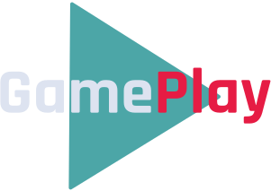

<p align="center">
  
</p>

<p align="center">
  <a href="#projeto">Sobre a aplicação</a>&nbsp;&nbsp;&nbsp;|&nbsp;&nbsp;&nbsp;
  <a href="#demo">Demonstração</a>&nbsp;&nbsp;&nbsp;|&nbsp;&nbsp;&nbsp;
  <a href="#requisitos">Como rodar</a>&nbsp;&nbsp;&nbsp;|&nbsp;&nbsp;&nbsp;
  <a href="#licenca">Licença</a>&nbsp;&nbsp;&nbsp;|&nbsp;&nbsp;&nbsp;
</p>

<span id="projeto">
  
## :bookmark_tabs: Sobre a aplicação
O aplicativo "GamePlay" tem como objetivo ajudar na organização de partidas em jogatinas com os amigos, onde, através da conexão com a conta do Discord, é possível agendar
os jogos, convidar amigos, compartilhar links para servidores, entre outras funcionalidades para controlar os diversos tipos de partidas e jogos!
- Aplicação construída na trilha de React Native durante a Next Level Week #06: Together (evento oferecido pela Rocketseat) 🚀

### :hammer_and_wrench: Tecnologias
As seguintes tecnologias e ferramentas estão sendo utilizadas neste projeto:

- [Figma](http://www.figma.com/)
- [React Native](https://reactnative.dev/)
- [Expo](https://expo.io/)
- [TypeScript](https://www.typescriptlang.org/)

<span id="demo">
  
## :iphone: Demonstração
Abaixo é possível encontrar uma demonstração das telas e funcionalidades do projeto desenvolvido, com a alteração de cores e algumas imagens, mas se quiser 
conferir o layout original das telas, é só acessar [este link](https://www.figma.com/file/0kv33XYjvOgvKGKHBaiR07/GamePlay---NLW-Together/duplicate) para o projeto no Figma.

> Em breve

<span id="requisitos">

## :gear: Como rodar
Com o [Node](https://nodejs.org/en/) e o [Expo](https://expo.io/) instalados em sua máquina e um emulador ou o [Expo Go](https://expo.io/client) no dispositivo físico, baixe ou clone este repositório e 
siga o passo a passo descrito abaixo.

```bash
# Acesse a pasta do projeto
$ cd nlw-06-gameplay

# Instale as dependências do projeto
$ npm install
# ou
$ yarn add

# Inicie o projeto
$ expo start
```
Agora o servidor do Expo estará ativo, verifique se seu celular e PC então na mesma rede e, preferencialmente, com o Firewall do PC desligado, 
então leia o QR Code pelo Expo Go ou entre por um emulador.

<span id="licenca">

## :page_with_curl: Licença
Esse projeto está sob a licença MIT. Veja o arquivo [LICENSE](LICENSE) para mais detalhes.

[](https://www.linkedin.com/in/mariagabrielareis/)
